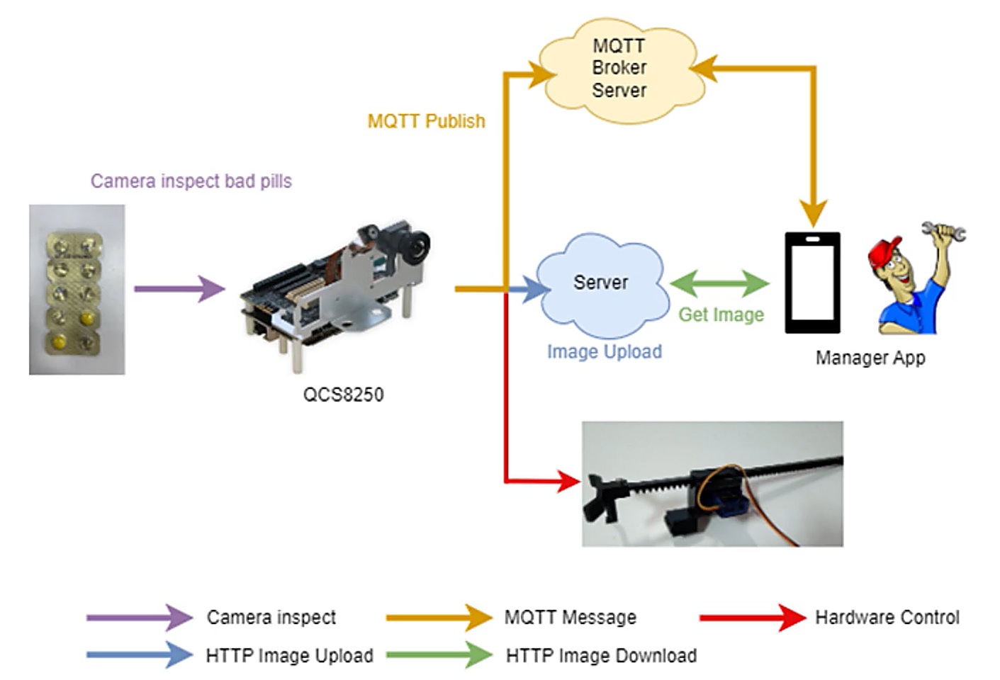

# QCS8250-Pills-Pack-Defect-Inspection

## Advantages of QCS8250

1. QCS8250 can provide up to 15 TOPS of AI computing power and supports GPU and DSP accelerated computing
2. The Qualcomm Neural Processing (SNPE) SDK and the Qualcomm AI Engine Direct (QNN) can optimize the performance of trained neural networks
3. It supports Android for AI development

## Performance Metrics

- **AI Model**: YOLOv5
- **System Performance**: 17~19 FPS

## Hardware

- **Platform**: [Qualcomm QCS8250](https://www.qualcomm.com/internet-of-things/products/q8-series/qcs8250)
- [輸送帶模組2.0寬版輸送帶總長360mm](https://shopee.tw/%E3%80%90R-D%E4%B8%8D%E5%B0%88%E6%A5%AD%E5%AF%A6%E9%A9%97%E5%AE%A4%E3%80%91%E8%BC%B8%E9%80%81%E5%B8%B6%E6%A8%A1%E7%B5%842.0(%E9%9C%80%E8%87%AA%E8%A1%8C%E7%B5%84%E8%A3%9D)%E8%BC%B8%E9%80%81-%E8%BC%B8%E9%80%81%E5%B8%B6-%E5%B0%88%E9%A1%8C-%E5%AF%A6%E9%A9%97-i.58927674.7669143894?sp_atk=91f28b30-9441-4b2d-b214-7ed8f0a9d49e&xptdk=91f28b30-9441-4b2d-b214-7ed8f0a9d49e)
- [線性電動缸推手1.0: SG90(360度)](https://shopee.tw/%E3%80%90R-D%E4%B8%8D%E5%B0%88%E6%A5%AD%E5%AF%A6%E9%A9%97%E5%AE%A4%E3%80%91%E8%BC%B8%E9%80%81%E5%B8%B6-SG90-MG995-996%E4%BC%BA%E6%9C%8D%E9%A6%AC%E9%81%94-3D%E5%88%97%E5%8D%B0-%E7%B7%9A%E6%80%A7%E9%9B%BB%E5%8B%95%E7%BC%B8-%E6%8E%A8%E6%89%8B(%E9%9C%80%E8%87%AA%E8%A1%8C%E7%B5%84%E8%A3%9D)%E5%B0%88%E9%A1%8C-%E5%AF%A6%E9%A9%97-i.58927674.9450246769?sp_atk=e1da3c5a-0d68-484c-8558-68c27efd2a83&xptdk=e1da3c5a-0d68-484c-8558-68c27efd2a83)
- [C6490 Development Kit](https://www.thundercomm.com/product/c6490-development-kit/)
- [ELP-USBFHD04H-L36 1080P H.264](https://www.amazon.com/-/zh_TW/Raspberry-USB2-0-%E8%A6%96%E8%A8%8A%E9%9F%B3%E8%A8%8A%E7%B6%B2%E8%B7%AF%E6%94%9D%E5%BD%B1%E6%A9%9F%E6%9D%BF-Lightburn-%E7%AD%86%E8%A8%98%E5%9E%8B%E9%9B%BB%E8%85%A6%E9%9B%B7%E5%B0%84%E7%9B%B8%E6%A9%9F/dp/B01E8OX212?th=1)
- [8-Channel Logic Level Bi-directional Converter Module TXS0108E TXB0108 Arduino](https://www.ebay.com/itm/314723076515)
- [L298N 馬達驅動板](https://www.amazon.com/-/zh_TW/%E9%A6%AC%E9%81%94%E9%A9%85%E5%8B%95%E6%8E%A7%E5%88%B6%E5%99%A8%E6%9D%BF%E6%A8%A1%E7%B5%84-%E6%A9%8B%E6%8E%A5%E7%9B%B4%E6%B5%81%E6%AD%A5%E9%80%B2%E5%99%A8-Arduino-%E6%99%BA%E6%85%A7%E6%B1%BD%E8%BB%8A%E6%A9%9F%E5%99%A8%E4%BA%BA-ESP826/dp/B00NJOTBOK)
- [Arducam原廠Controller Board For PTZ Camera moudle（單控制板）](http://oceansky-technology.com/commerce/product_info.php?products_id=20742)
- [熱感式 / 熱轉式兩用 GoDEX530條碼列印機](https://www.godexintl.com/product/G500_G530?locale=zh_TW)

## Software & Toolkit

- **AI SDK (SNPE):** v2.14
- **System:** Android

## Background & Solution

### Motivation

To solve the defective pills pack issue in the production line

### Solution

Using AI technology to detect and remove defects from the production line

## Architecture Diagram

After QCS8250 inspects the defective pills pack, it activates the push rod to push the defect pills pack out of the production line. At the same time, it takes an image screenshot and uploads it to the cloud via HTTP. It also sends an MQTT message to the Manager App through the MQTT Broker Server. After receiving the MQTT message, the Manager App obtains the picture through an HTTP URL, so that the Manager can understand the filling status of the pills pack in a timely manner.

## Demo

https://github.com/user-attachments/assets/44118c15-f9f1-4742-82b7-893b26d9ea34

